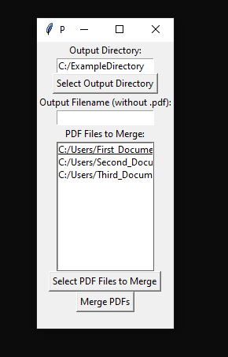

## Merge PDFs with Python

This tool allows the user to select PDFs using an input GUI created with the tkinter library and merges them with tools from the PyPDF2 library.

Since I didn't bother with a requirements file, this tool requires the libraries *os*, *PyPDF2* and *tkinter*, so make sure to:
``pip install os``
``pip install PyPDF2``
and
``pip install tkinter``

NOTE: The script has to be placed in the Windows system and will **NOT RUN** properly on the Ubuntu sub-system. The tkinter library uses the ``Display`` variable to display the input GUI. Ubuntu can not properly reference this variable, unless its properly set by manual user input. There are some suggested solutions online [suggested solutions online](https://stackoverflow.com/questions/37604289/tkinter-tclerror-no-display-name-and-no-display-environment-variable), feel free to try them. However, for a more consistent performance, simply put the python file in a Windows-level folder.

In the GUI, select the desired output directory and add files from the file explorer in the desired order of merging.

